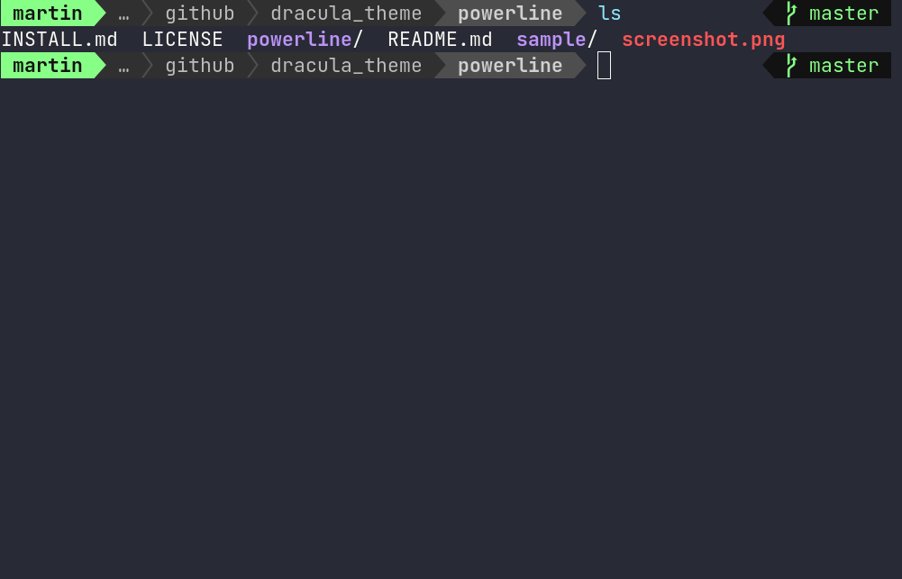

# Dracula for [Foobar](https://foobar.com)

> A dark theme for [Powerline](https://github.com/powerline/powerline).

## Install

* Download release files, or git clone repo
* Copy files in powerline/ folder
* Paste/to files in your ~/.config/powerline folder

All instructions can be found at [draculatheme.com/powerline](https://draculatheme.com/powerline).

## Team

This theme is maintained by the following person(s) and a bunch of [awesome contributors](https://github.com/dracula/foobar/graphs/contributors).

|  |
| ---------------------------------------------------------------------------------------- |
| [Zeno Rocha](https://github.com/zenorocha)                                               |

|  |
| ---------------------------------------------------------------------------------------- |
| [Zeno Rocha](https://github.com/martinlindelof)                                               |
## Community

- [Twitter](https://twitter.com/draculatheme) - Best for getting updates about themes and new stuff.
- [GitHub](https://github.com/dracula/dracula-theme/discussions) - Best for asking questions and discussing issues.
- [Discord](https://draculatheme.com/discord-invite) - Best for hanging out with the community.

## License

[MIT License](./LICENSE)
